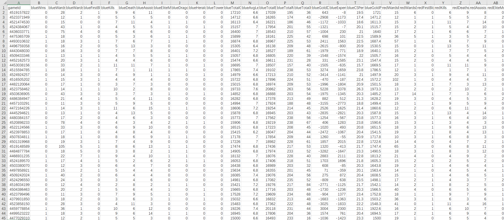
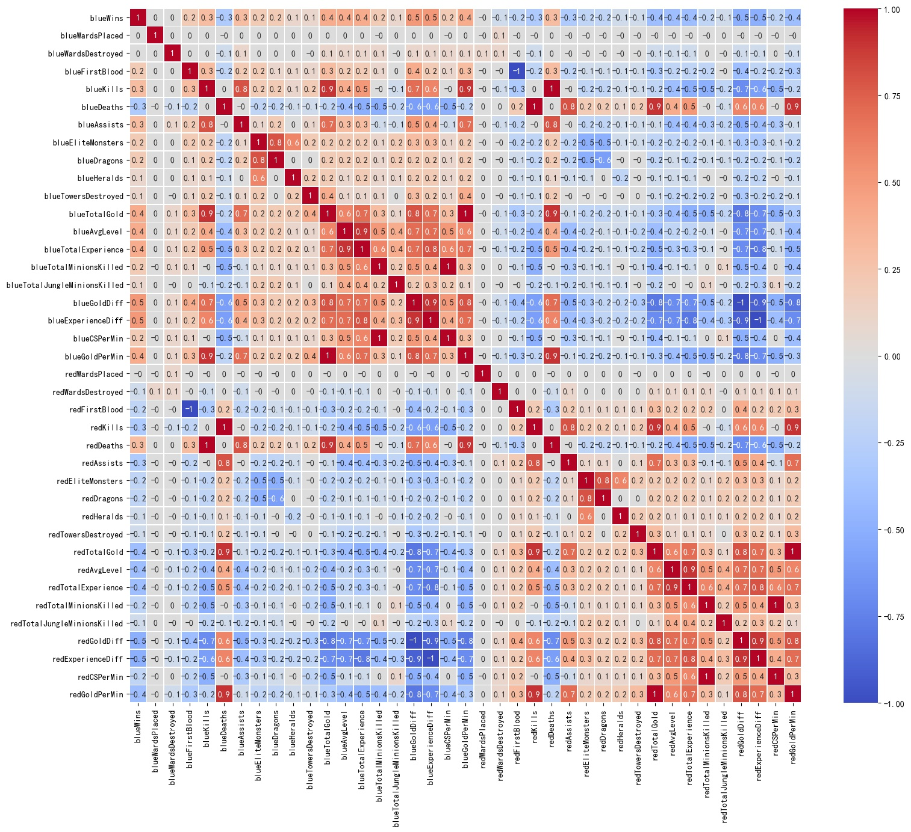
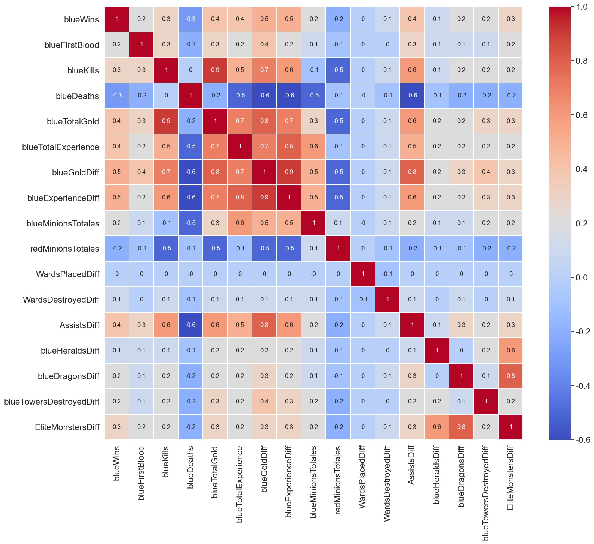
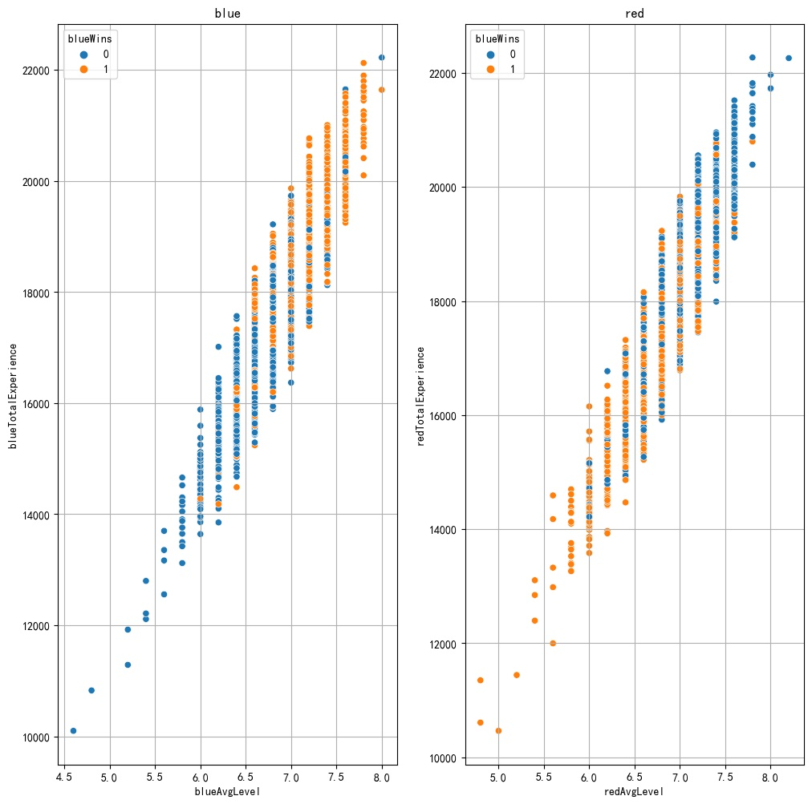
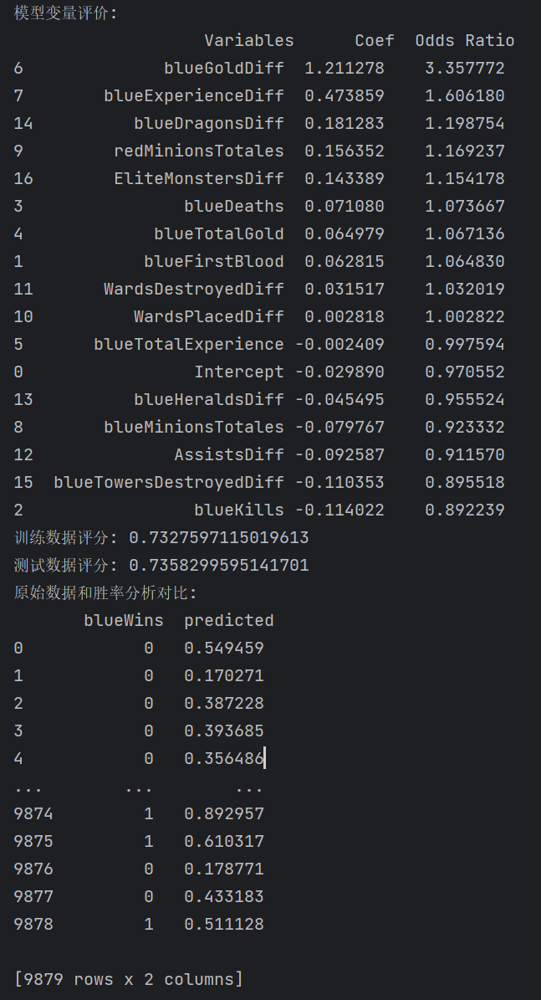

<h1>
    <center>
        Ds Final Assignment
    </center>
<h3>
    <center>
        通过对一局LOL游戏前十分钟的对局数据分析，预测该局游戏的最终胜方

<h3>
    <center>
        朱维清 10215300402
</h3>

---

### 一、作业背景

#### 1. LOL简介：

​		LOL（英雄联盟）是目前全球玩家人数最多的MOBA（多人在线战斗竞技场）游戏，一场游戏分为红蓝两方共10人进行对战，赢得游戏的条件是击破敌方的水晶基地。
​		战线共3路，每条战线由小兵（Minions）、防御塔（Towers）、英雄（即玩家）组成。
​		战线间由野区（Jungle）相连，野区由资源怪（Jungle Minions）、主宰（Elite Monster）、先锋（Heralds）和龙（Dragons）组成。
​		玩家英雄通过击杀小兵、野怪、敌方英雄、防御塔获得经验与金钱并升级、购买装备，最后摧毁敌方水晶达成胜利。

#### 2. 作业简介：

​		由于一局普通模式游戏的平均时长大概在30分钟左右，本作业希望通过分析**前10分钟红蓝双方的各项数值差异来预测一局游戏最后由红方还是蓝方获得胜利**，对赛事预测和对局状况分析有可行作用，并找出哪几个对局数据对游戏走势有相对重要的影响。
​		本作业通过数据约简、构建特征值热力图、分析特征值相关性、运用Logistic Regression模型进行回归预测等方式实现上述目标。

#### 3. 数据集：

+ 数据集包含LOL某区的钻石Ⅰ~ 超凡大师段位近10000场排位对局前10分钟，红蓝双方各19个特征值共38个特征值的数据。



+ **数据集来源**：[League of Legends Diamond Ranked Games (10 min) (kaggle.com)](https://www.kaggle.com/datasets/bobbyscience/league-of-legends-diamond-ranked-games-10-min/discussion)

+ **数据特征值与标签详解：**

```python
Index(['gameId',                         #每局游戏ID
       
       'blueWins',                       #标签值：蓝方是否获得胜利，1:胜利、0:失败
       
       'blueWardsPlaced',                #蓝方放置的视野数量
       'blueWardsDestroyed',             #蓝方摧毁的敌方视野数量
       'blueFirstBlood',                 #蓝方是否获得一血，1:获得、0:未获得
       'blueKills',                      #蓝方杀死敌方英雄数量
       'blueDeaths',                     #蓝方死亡人数
       'blueAssists',                    #蓝方助攻数
       'blueEliteMonsters',              #蓝方杀死的主宰数量
       'blueDragons',                    #蓝方杀死的龙数量
       'blueHeralds',                    #蓝方杀死的先锋数量
       'blueTowersDestroyed',            #蓝方摧毁的防御塔数量
       'blueTotalGold',                  #蓝方总金币数量
       'blueAvgLevel',                   #蓝方平均等级
       'blueTotalExperience',            #蓝方总经验
       'blueTotalMinionsKilled',         #蓝方杀死的小兵总数
       'blueTotalJungleMinionsKilled',   #蓝方杀死的野怪总数
       'blueGoldDiff',                   #蓝方与红队金币差值
       'blueExperienceDiff',             #蓝方与红方经验差值
       'blueCSPerMin',                   #蓝方每分钟摧毁红方视野数量
       'blueGoldPerMin',                 #蓝方每分钟获得金币数量
       
       #红方与蓝方相同
       'redWardsPlaced',           
       'redWardsDestroyed',
       'redFirstBlood',
       'redKills',
       'redDeaths',
       'redAssists',
       'redEliteMonsters',
       'redDragons',
       'redHeralds',
       'redTowersDestroyed',
       'redTotalGold',
       'redAvgLevel',
       'redTotalExperience',
       'redTotalMinionsKilled',
       'redTotalJungleMinionsKilled',
       'redGoldDiff',
       'redExperienceDiff',
       'redCSPerMin',
       'redGoldPerMin'])
```


### 二、代码分析

#### 1. 数据约简

​		首先生成并保存一张原始数据集的热力图，可见其中有相当一部分特征值的相关性较高，可达-1或1，如blueKills（蓝方击杀）和redDeaths（红方被击杀），显然是包含相同含义的特征值。



​		为了减轻后续数据分析的复杂度，消除了一些高相关性的特征值，并将一些可结合成差额特征值的特征值做约简，生成一张数据约简后的热力图。



#### 2. 相关性分析

​		根据未进行数据约简的热力图可见，如blueAvgLevel（蓝方平均等级）和blueTotalExperience（蓝方总经验值）相关程度可达0.9，绘制散点图，可知两者近似为线性关系。又由于红蓝方平均等级差别不大，故在特征值中去除blue/redAvgLevel。



​		对部分特征值进行数据可视化，绘制散点图，如KDA（击杀、死亡、助攻比），金钱、经验、摧毁防御塔、击杀线上小兵的胜负分布：


​		采用逻辑回归模型，对数据约简后的16个特征值进行建模预测。
​		首先创建一个自定义的缩放器类以便通过fit()和tranform()函数进行数据标准化，分割训练集与测试集后代入模型进行训练，最后输出各特征值的系数预测精确度与模型性能。



#### 3. 结论

​		根据上述分析可见，对局的第10分钟这个时间点，对后续对局结果影响**最大的因素是blueGoldDiff（双方经济差），其次是blueExperienceDiff（双方经验差）**，与游戏常识相符。**当双方经济差增加一个标准化单位时，胜率增加235%；当双方经验差增加一个标准化单位时，胜率增加60.6%。在前十分钟多击杀一条Dragon可以增加20%左右的胜率。**
​		但也有与常识相悖的结论，比如**前10分钟击杀的敌方英雄数blueKills越多、摧毁的敌方防御塔blueTowersDestroyedDiff越多，预测游戏胜率越低**。由于这几个特征值的系数绝对值并不大（仅为-0.1左右），推测可能是**当前版本阵容、英雄有前后期之分，拥有前期强势阵容方并没有在前10分钟拉开足够大的优势，导致过了强势前期被敌方更为强势的后期翻盘**，这在钻石以上的高端局很常见。