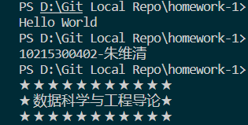
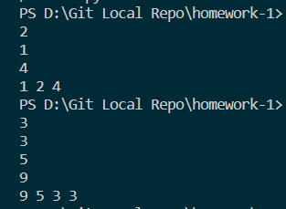
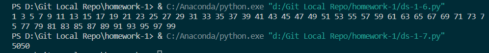
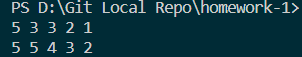
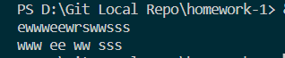
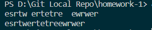
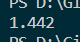
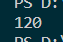

<h1>

Data Science Homework-1
    

</h1>

<h4>
    

    	朱维清 10215300402
    

---

#### 2.3.4输出图示：

#### 5.6排序输出图示：

#### 7.8循环输出图示：

#### 9 for、while排序输出图示（①输入为2 1 3 5 3，②输入为2 5 4 5 3）：

#### 10遍历输出连续字符：

#### 11去除空格：

#### 12二分法求三次方根，输入为3：

#### 13求阶乘：

