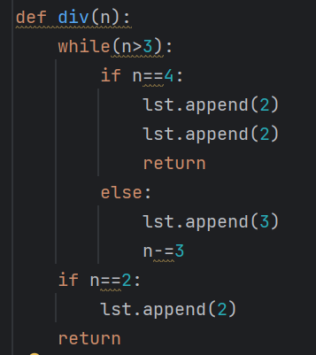
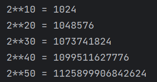
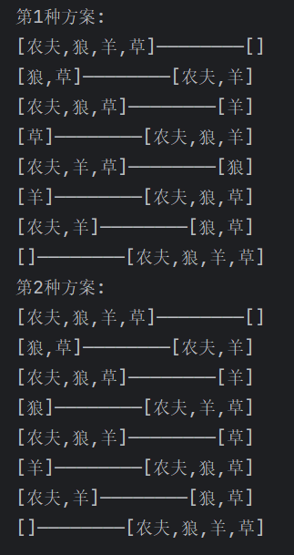
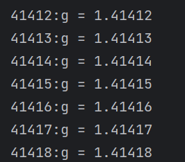
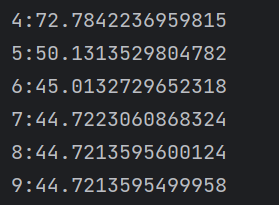
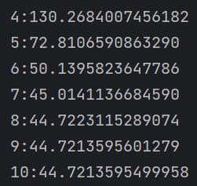
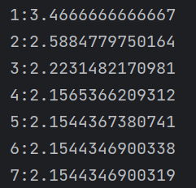
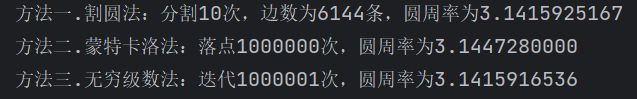

<h1>

Data Science Homework-1
    

</h1>

<h4>
    

    	朱维清 10215300402
    

---

#### 1.

（1）2001=3**667
（2）找规律，每个>=4的数都能分解成2或3的乘积，使得因子3尽可能多，但对每个数的分解不能包含1，如7 = 3 + 3 + 1 = 3 + 2 + 2，但3 * 3 * 1 < 3 * 2 * 2，多余的1与一个3合成2*2，使得积更大。
（3）

#### 2.用2 ** 10=1024作为基数，每次乘以这个基数比乘以2 ** 10更快：

#### 3.渡河问题，穷举法，建立 人是否带物过河 与 前后状态函数 与 判断是否重复函数

#### 4.

#### 5. c=2000时：

#### 6. c=2000、g=c时：迭代次数增多

#### 7. 三次方牛顿迭代式为：g = (2 * g + c / (g * g)) / 3

#### 8. 三个方法分别为：割圆法、蒙特卡洛法、无穷级数法（莱布尼茨级数）：

割圆法在切割（循环）次数较少时也有更高的精确度；蒙特卡洛法由于需要大量随机落点进行面积比，效率最低；无穷级数法取偏差为0.0000005时，与落点1000000次的蒙特卡洛法相比，耗时相差不大但得到圆周率更精确，稍逊于最高效的割圆法，效率适中。

#### 9. 取y上界为20，落点1000000次：

