<h1>

Data Science Homework-3
    

</h1>

<h4>
    

    	朱维清 10215300402
    

---

#### 1.十进制到二进制小数转换：

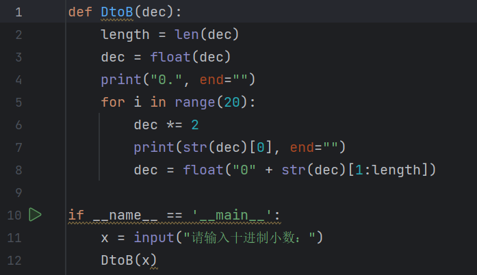

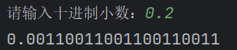

​		由于直接对输入小数乘2取余，若该十进制小数无法转化为有限二进制小数，会在多次迭代后出现误差越来越大的情况，故采用字符串的方式处理，确定十进制小数最初长度（即小数位数）length，保证后续迭代不出现误差。

#### 2.产生10-20之间随机浮点数：

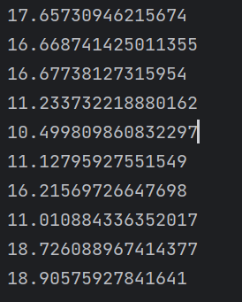

#### 3.正则表达式简单验证身份证号是否合法：

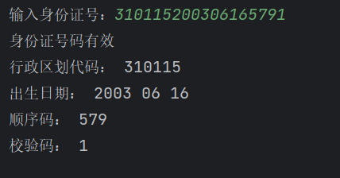

​		简单匹配了18位身份证号，并未按照各位权重计算校验码是否正确。

#### 4.实现单向链表：

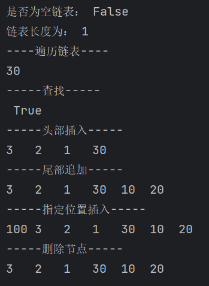

#### 5.6.7输出结果：

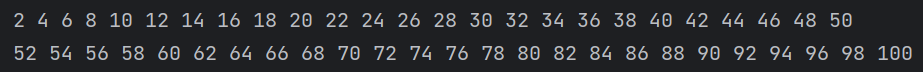

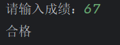

#### 8.插入、快速、希尔、选择、归并排序在不同长度数列下的运行效果：

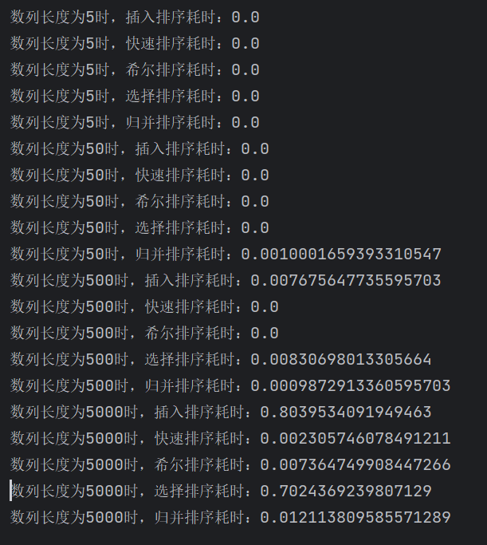

​		插入排序和选择排序时间复杂度相同，在数组较大时耗时最多；归并排序耗时第二多；希尔排序耗时第三；快速排序最快。

#### 9.构建乘积数组：

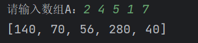

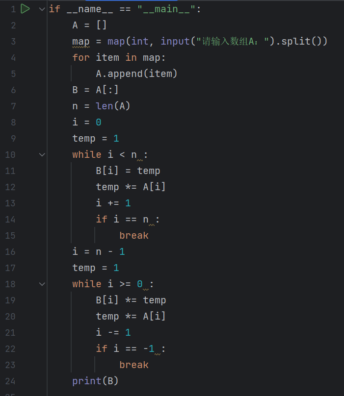

​		对于B的每个元素全部叠乘的时间复杂度太高。这一算法采用两次循环和中间值temp用来与下标i同时变化，第一次循环保证B[i]当前值的来源因子不包括A[i]且只计算了A[i]的左侧乘积；第二次循环补上A[i]的右侧乘积。

#### 10、11输出结果：

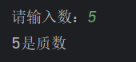

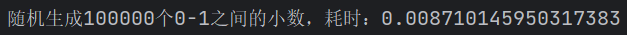

​		计算程序耗时需要import time，运用库函数time.time()。

#### 12.

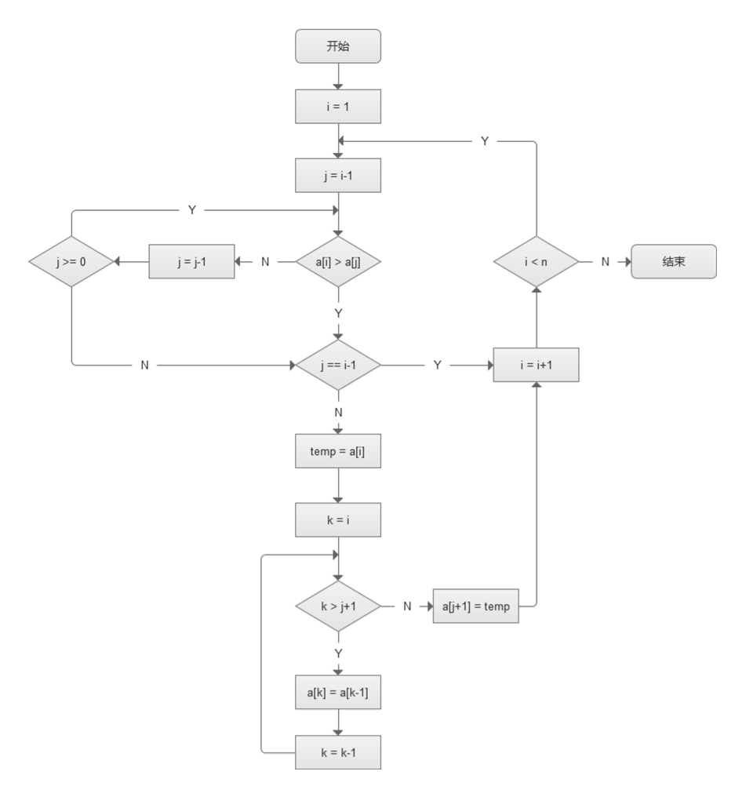

#### 13.选择排序时间复杂度和空间复杂度：

​		时间复杂度：O(n^2)

​		空间复杂度：O(1)