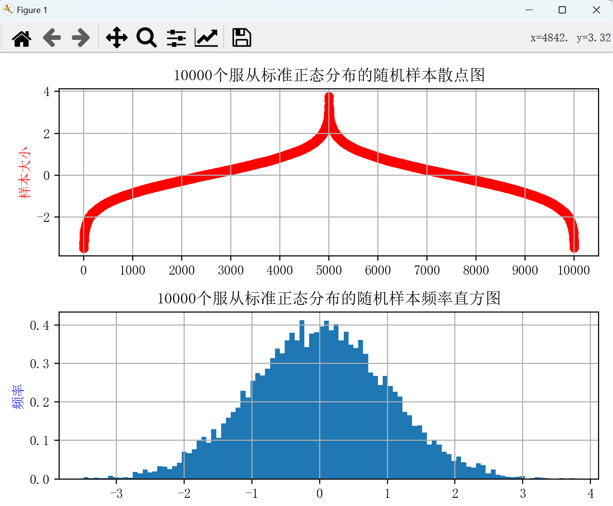
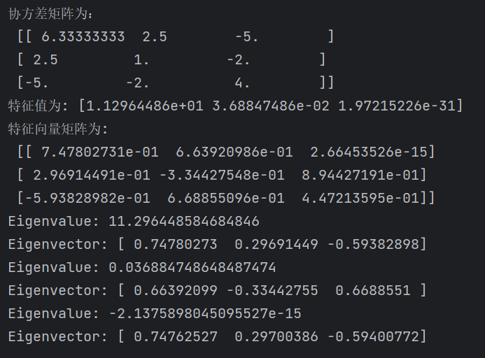

<h1>
    

        Ds-homework-5
</h1>

<h3>
    

        朱维清 10215300402
</h3>

---

#### 1.2. 生成服从标准正态分布的10000个样本并绘图

#### 3.4 计算特征值和特征向量，用幂迭代法计算最大特征值:

#### 5.6 计算协方差矩阵，用幂迭代法求出所有特征值和特征向量：

​		由于第三个特征值实在太小（10^(-31)），幂迭代法会出现某个特征向量的估计值不稳定或范数非常小的情况，导致第三个特征值的估计值和对应的特征向量的估计无法算出。

