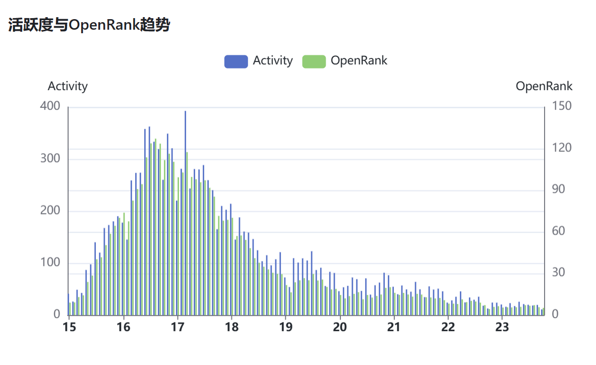
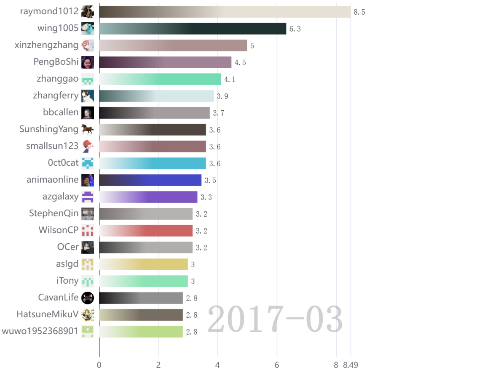
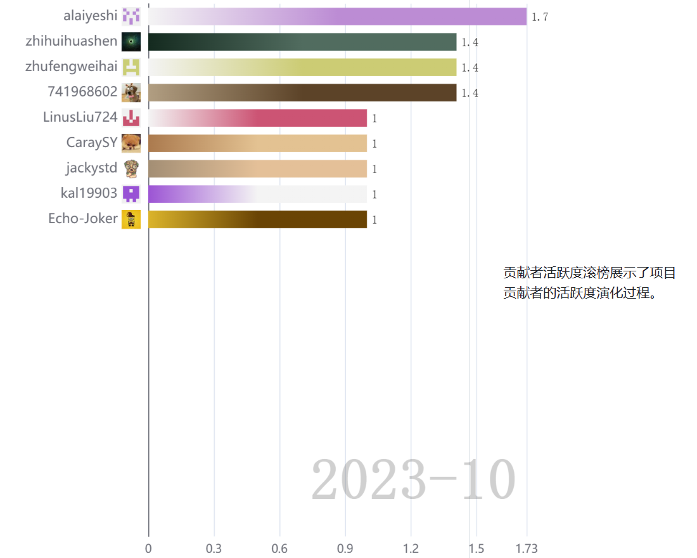
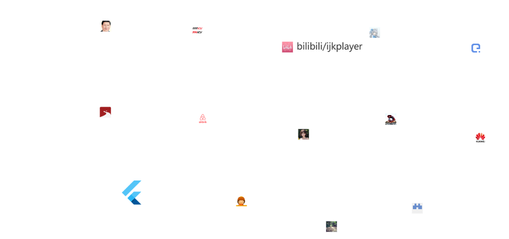
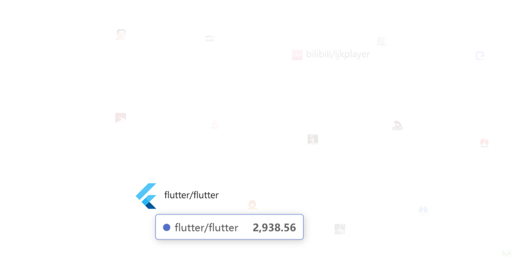

<h2>
    

        使用HyperCRX插件观察Bilibili/ijkplayer项目
</h2>

#### 项目链接：[bilibili/ijkplayer (github.com)](https://github.com/bilibili/ijkplayer/)

Bilibili的ijkplayer是一个基于FFmpeg的轻量级Android/iOS视频播放器。bilibili/ijkplayer仓库的内容是ijkplayer播放器的程序文件、版本记录、和Android/iOS安装文件。

---

#### 项目相关信息

+ ijkplayer项目的开发主要集中在2016-2018年间，之后播放器趋于稳定，版本更新频率变低。

+ 根据活跃度与OpenRank趋势图，在2017年3月，ijkplayer的开发活跃度处于顶峰，下图为2017年3月的开发人员活跃情况；

+ 下图为当月ijkplayer的开发人员活跃情况：

+ 项目关系网络图：

可见，在90天内，ijkplayer的开发与其他项目的联结性并不大，可能是由于项目开发活跃度并不高导致项目开发较为独立的缘故。

+ 项目活跃开发者协作网络图：

#### 总结

HyperCRX插件对github仓库的一些数据可视化的帮助是显而易见的，项目的开发活跃度、最近与其他项目的相关性和最近活跃的开发人员都能一目了然。