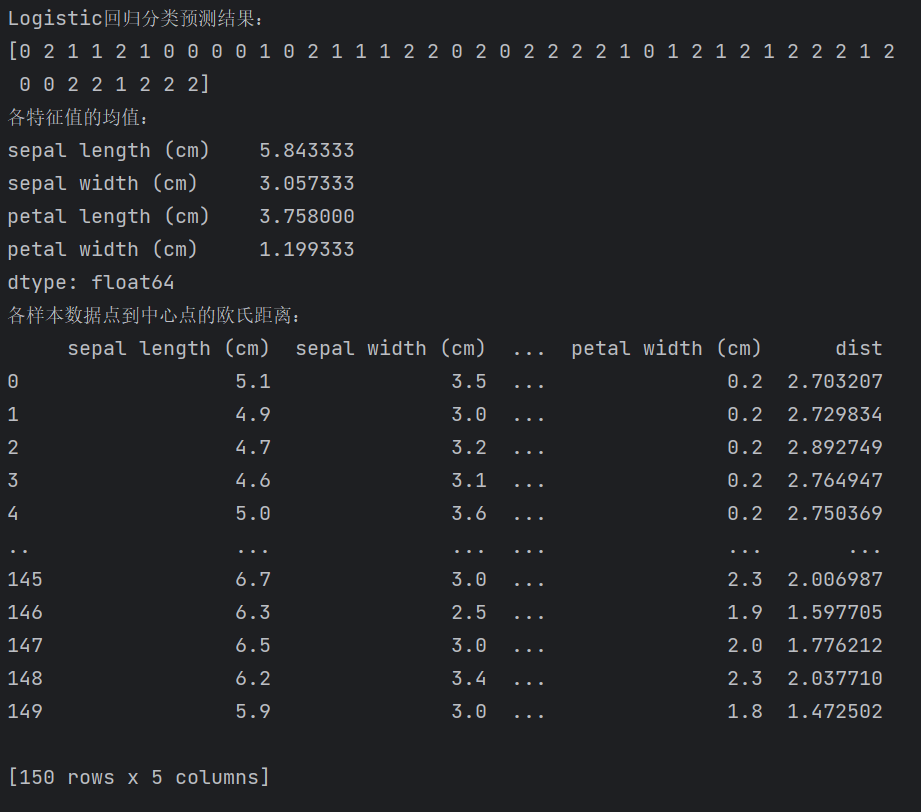
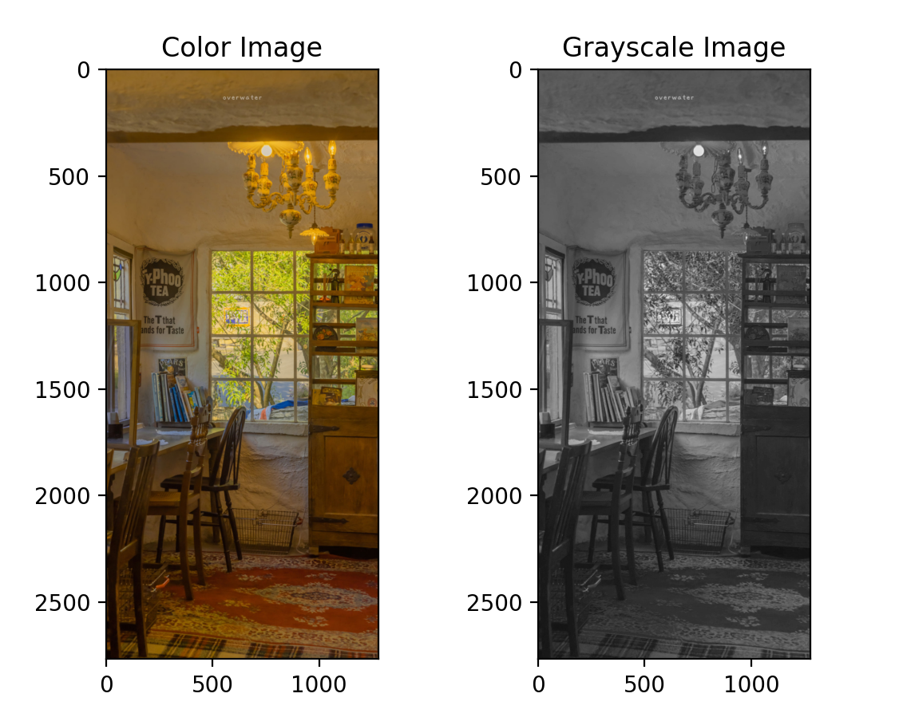
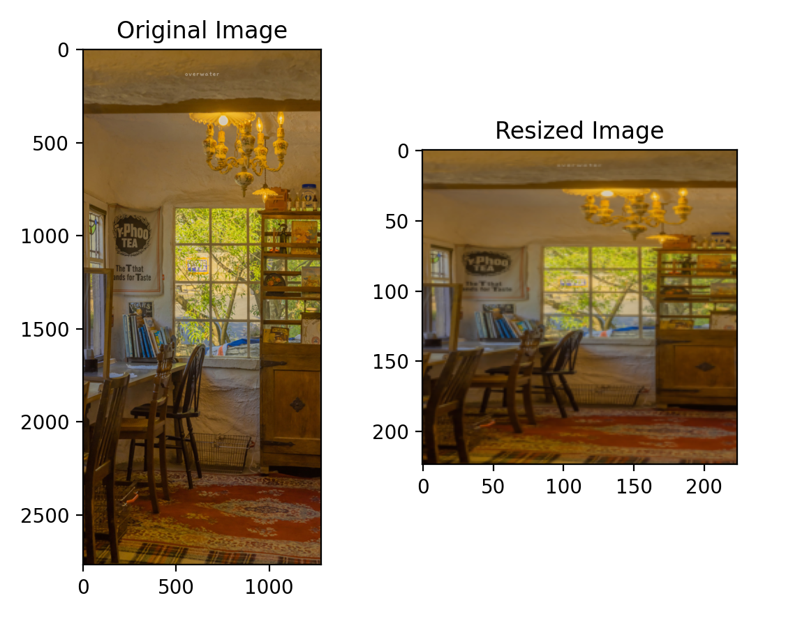
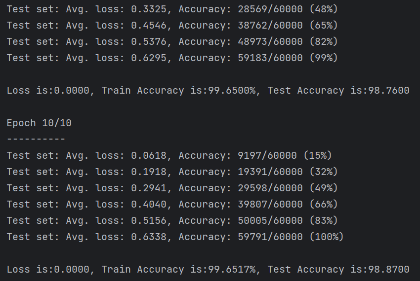

<h1>
    

        Ds-homework-7
</h1>

<h3>
    

        朱维清 10215300402
</h3>
---

### 11.6~9

#### 读取鸢尾花数据集，按照3：7比例划分测试集和训练集；

#### Logistic回归分类鸢尾花数据集；

#### 计算鸢尾花数据集不同特征值的均值与每个数据点到中心点的欧氏距离；

#### K-means算法对鸢尾花数据集进行聚类

### 12.4 Pytorch实现Logistics回归模型分类鸢尾花数据集

### 12.5 读入一张图片，用神经网络实现将图片转换为灰度图像；将图片放缩成指定尺寸

### 12.7-8 Pytorch构建LeNet - 5模型；基于Mnist数据集和LeNet - 5模型，设定参数训练LeNet - 5模型

​		LeNet-5的基本结构包括7层网络结构（不含输入层），其中包括2个卷积层、2个降采样层（池化层）、2个全连接层和输出层。

​		用于训练的数据集为MNIST手写数字识别数据集。

### 12.6 手写汉字识别

