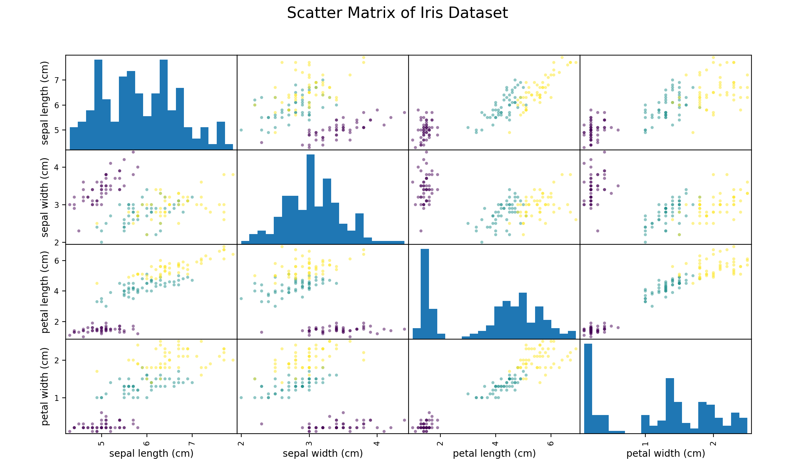
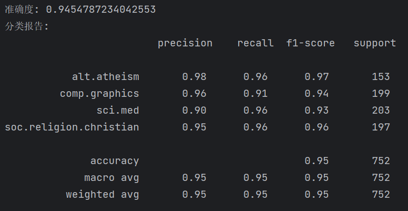
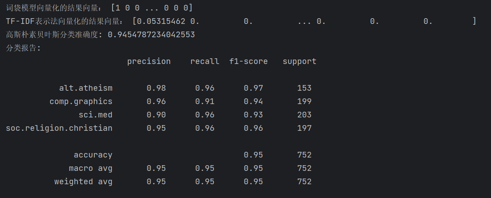
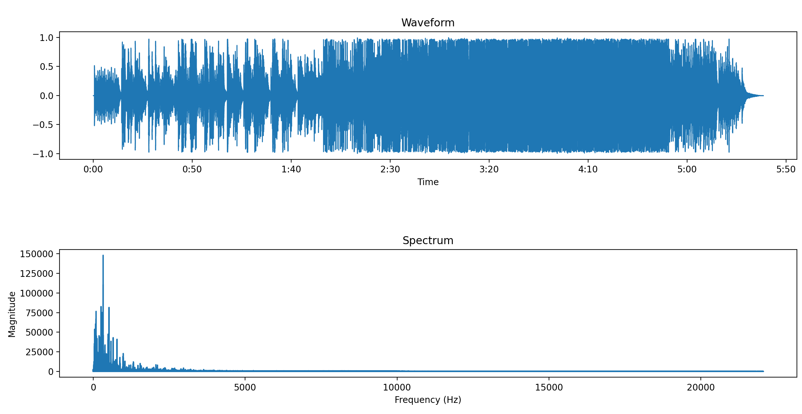
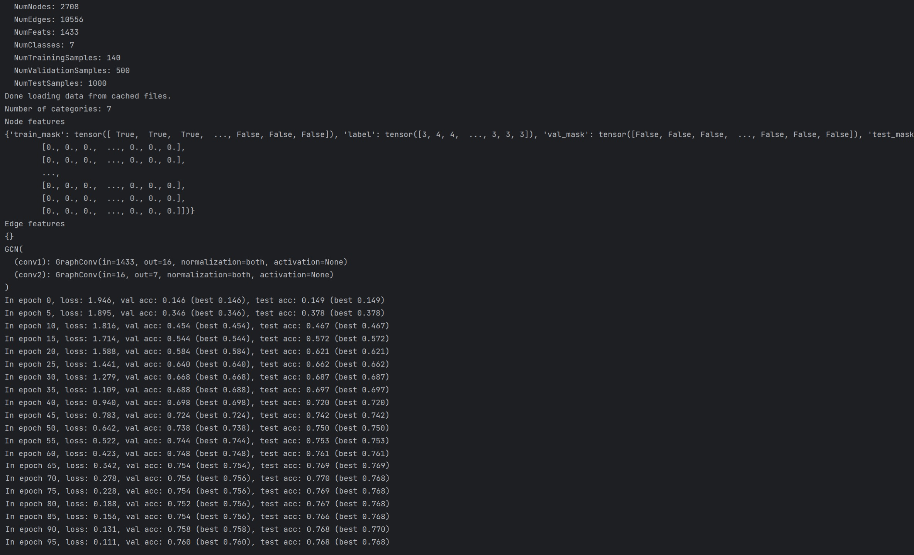
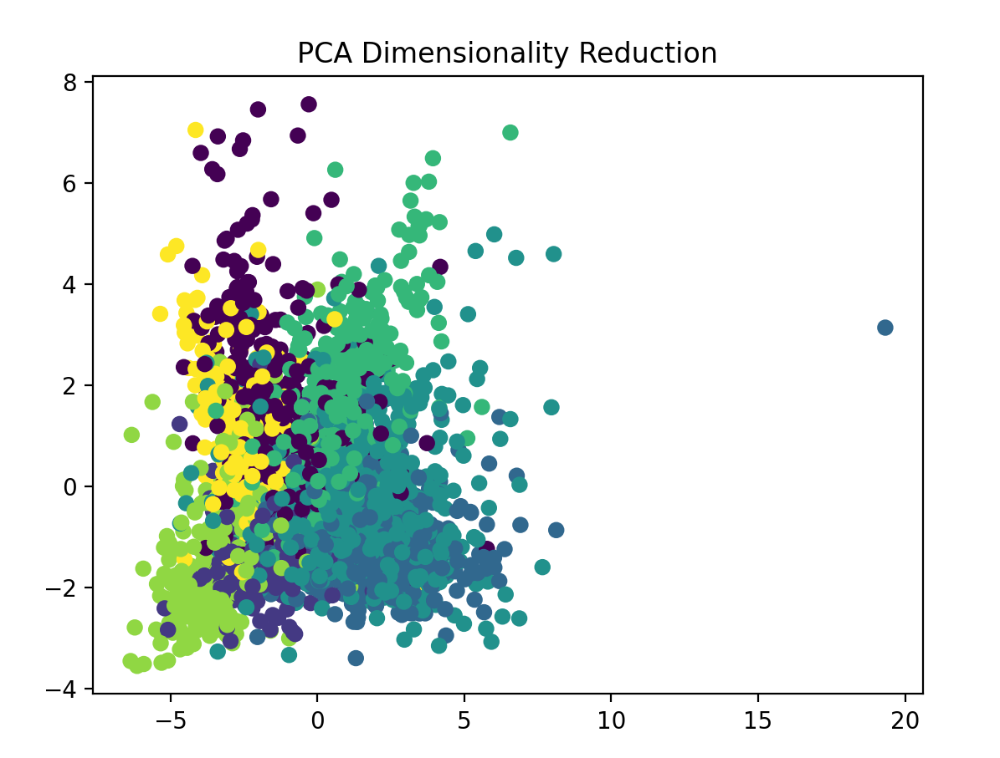

<h1>
    

        Ds-homework-8
</h1>

<h3>
    

        朱维清 10215300402
</h3>
---

### 13-1.2.3 对鸢尾花数据集进行特征可视化；切分训练集、测试集；KNN分类数据集，输出准确度。

生成各特征值的散布矩阵。

KNN分类器准确度：

### 13-8 对20_newsgroups进行分类。

采用TF-IDF表示法进行词袋模型的向量化，再采用高斯朴素贝叶斯分类器进行分类。

### 14-2.3.4 使用词袋模型对任意文本（此处采用20_newsgroups数据集）进行向量化，输出结果向量；运用TF-IDF表示法向量化20_newsgroups数据集，输出第一个文本的结果向量；运用朴素贝叶斯方法对向量化文本进行分类，输出分类准确度。

### 14-5 对一段音频进行快速傅里叶变换，并可视化结果。

### 14-8 对Cora图数据集进行分类。

通过DGL框架搭建GCN图卷积神经网络模型。

### 14.9 对Cora图数据集的分类结果使用PCA算法进行降维，并进行二维展示。

